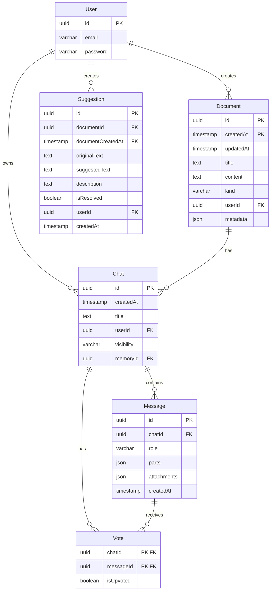

# AI-Chronicle Database Schema

## Entity Relationship Diagram

## Tables Description

### User
- **id**: UUID, primary key
- **email**: varchar(64), unique user email
- **password**: varchar(64), hashed password

### Document
The Document table serves as a generic document store. Memories are stored as documents with kind='text'.

- **id**: UUID, primary key (part 1)
- **createdAt**: timestamp, primary key (part 2) 
- **updatedAt**: timestamp, when the document was last modified
- **title**: text, document title
- **content**: text, document content
- **kind**: enum ('text', 'code', 'image', 'sheet'), default 'text'
- **userId**: UUID, foreign key to User.id
- **metadata**: JSON, flexible storage for additional properties:
  - **tags**: string array, tags for categorization
  - **isPublic**: boolean, visibility setting
  - **summary**: string, AI-generated summary
  - **source**: string, where the memory came from
  - **aiGenerated**: boolean, whether AI created the memory

Indexes:
- document_user_idx on userId
- document_kind_idx on kind

### Chat
- **id**: UUID, primary key
- **createdAt**: timestamp, when the chat was created
- **title**: text, chat title
- **userId**: UUID, foreign key to User.id
- **visibility**: enum ('public', 'private'), default 'private'
- **memoryId**: UUID, foreign key to Document.id (can be null for standalone chats)

Indexes:
- memory_idx on memoryId
- chat_user_idx on userId

### Message
- **id**: UUID, primary key
- **chatId**: UUID, foreign key to Chat.id
- **role**: varchar, message sender role (e.g., 'user', 'assistant')
- **parts**: JSON, message content parts
- **attachments**: JSON, attached files/media
- **createdAt**: timestamp, when the message was created

### Vote
- **chatId**: UUID, foreign key to Chat.id, part of composite primary key
- **messageId**: UUID, foreign key to Message.id, part of composite primary key
- **isUpvoted**: boolean, whether it's an upvote or downvote

### Suggestion
- **id**: UUID, primary key
- **documentId**: UUID, foreign key to Document.id
- **documentCreatedAt**: timestamp, foreign key to Document.createdAt
- **originalText**: text, the text being suggested for change
- **suggestedText**: text, the suggested replacement
- **description**: text, explanation of the suggestion
- **isResolved**: boolean, whether the suggestion has been addressed
- **userId**: UUID, foreign key to User.id
- **createdAt**: timestamp, when the suggestion was created

## Relationships

1. **User to Document**: One-to-many. A user can create multiple documents.
2. **User to Chat**: One-to-many. A user can own multiple chats.
3. **User to Suggestion**: One-to-many. A user can create multiple suggestions.
4. **Document to Chat**: One-to-many. A document (memory) can have multiple associated chats.
5. **Chat to Message**: One-to-many. A chat contains multiple messages.
6. **Chat to Vote**: One-to-many. A chat has votes on its messages.
7. **Message to Vote**: One-to-many. A message can receive multiple votes.

## Memory-Chat Relationship

Documents with kind='text' are considered Memories. The Chat table has a foreign key `memoryId` that can point to a Document, establishing a relationship between memories and their associated chats.

This design allows for:
1. Standalone memories without chats
2. Standalone chats without associated memories
3. Memories with one or more associated chats
4. Efficient querying of chats related to a specific memory 